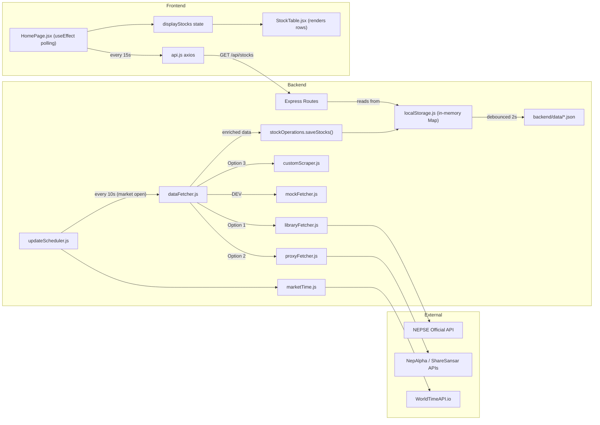

# MASTER CODEBASE OVERVIEW

> Complete architecture document for the **NEPSE Stock Website**.
> Goal: If you deleted all the code but kept this document, you could rebuild the architecture exactly.

---

## 1. Annotated File Tree (The Map)

### Backend (`backend/`)

```
backend/
├── package.json                            # Scripts: dev, start, pm2:*, test. Deps: express, axios, node-schedule, nepse-api-helper, winston.
├── ecosystem.config.js                     # PM2 process manager config for production deployment.
├── jest.config.js                          # Jest test configuration.
├── .env.example / .env.test                # Environment variable templates.
├── README.md                               # Backend-specific documentation.
│
├── data/                                   # [RUNTIME] Persisted JSON files (created at runtime).
│   ├── stocks.json                         # All stock data, keyed by symbol.
│   ├── marketSummary.json                  # Latest market summary (NEPSE Index, turnover, etc.).
│   ├── marketHistory.json                  # Historical market summary records.
│   ├── ipos.json                           # IPO listings.
│   └── topMovers.json                      # Cached top gainers/losers/volume lists.
│
└── src/
    ├── server.js                           # **MAIN ENTRY POINT**. Creates Express app, mounts routes, starts scheduler.
    │
    ├── routes/
    │   ├── stocks.js                       # GET /api/stocks, /api/stocks/:symbol, /api/stocks/search, /api/stocks/top-*, admin endpoints.
    │   ├── market.js                       # GET /api/market-summary, /api/health, /api/scheduler-status, POST /api/force-update.
    │   └── ipos.js                         # GET /api/ipos, /api/ipos/active, /api/ipos/status/:status.
    │
    ├── middleware/
    │   ├── cors.js                         # CORS configuration for frontend access.
    │   └── errorHandler.js                 # Global async error handler, 404 handler, validation error handler.
    │
    ├── services/
    │   ├── dataFetcher.js                  # **ORCHESTRATOR**: Tries scrapers in order (Library → Proxy → Custom → Mock). Enriches data with company names.
    │   │
    │   ├── scrapers/
    │   │   ├── libraryFetcher.js           # **OPTION 1**: Uses `nepse-api-helper` npm package to fetch from official NEPSE API (with token handling).
    │   │   ├── proxyFetcher.js             # **OPTION 2**: Fetches from NepAlpha/ShareSansar APIs as fallback.
    │   │   ├── customScraper.js            # **OPTION 3**: Placeholder for direct NEPSE website scraping (not fully implemented).
    │   │   └── mockFetcher.js              # **DEV MODE**: Generates simulated stock data for development.
    │   │
    │   ├── scheduler/
    │   │   └── updateScheduler.js          # **HEART OF THE SYSTEM**: Calls `dataFetcher.fetchLatestData()` every 10s during market hours, 1hr otherwise. Uses `node-schedule` for daily cleanup. Relies on `marketTime.js` for accurate Nepal time.
    │   │
    │   ├── database/
    │   │   ├── connection.js               # `connectDB()` / `disconnectDB()` wrappers for local storage.
    │   │   ├── localStorage.js             # **CORE STORAGE**: In-memory Maps + debounced JSON file persistence. Contains `stockOps`, `marketOps`, `ipoOps`.
    │   │   ├── stockOperations.js          # Re-exports stock functions from localStorage.js for cleaner imports.
    │   │   ├── marketOperations.js         # Re-exports market functions from localStorage.js.
    │   │   └── ipoOperations.js            # Re-exports IPO functions from localStorage.js.
    │   │
    │   └── utils/
    │       ├── logger.js                   # Winston logger configuration (console + file).
    │       ├── marketTime.js               # **TIME SYNC**: Fetches accurate Nepal time from WorldTimeAPI/TimeAPI.io, calculates offset from system clock, determines market state (OPEN/CLOSED/WEEKEND).
    │       └── errorHandler.js             # Utility error wrapper (different from middleware).
    │
    ├── utils/
    │   └── storage.js                      # `safeWriteJson()` / `safeWriteJsonSync()` - atomic JSON writes with temp file.
    │
    ├── data/
    │   └── nepseStocks.js                  # Static list of ~270 NEPSE symbols with company names and sectors for enrichment.
    │
    ├── scripts/                            # Dev/debug scripts (analyze_stocks, check_time, etc.).
    └── tests/                              # Jest test files (unit + integration).
```

---

### Frontend (`frontend/src/`)

```
frontend/src/
├── main.jsx                                # React DOM render, BrowserRouter wrapping.
├── App.jsx                                 # **ROOT COMPONENT**: Manages global search state, renders Header and Routes.
├── App.css                                 # **DESIGN SYSTEM**: All CSS variables (palette, typography, spacing, shadows), reset, utilities.
│
├── pages/
│   ├── HomePage.jsx / HomePage.css         # **MAIN VIEW**: Fetches ALL stocks (paginated loop), renders Market Summary, Sector Chart, StockTable. Computes Market Breadth client-side.
│   ├── StockDetailPage.jsx / .css          # Single stock detail view with price history.
│   ├── IPOPage.jsx / .css                  # IPO listings with status filtering.
│   ├── TopMoversPage.jsx / .css            # Top gainers/losers/traded stocks.
│   └── SearchResultsPage.jsx / .css        # Displays search results from Header search bar.
│
├── components/
│   ├── Header.jsx / Header.css             # Sticky header, logo, navigation, global SearchBar component.
│   ├── SearchBar.jsx / .css                # Input + dropdown autocomplete, updates globalSearch state in App.
│   ├── StockTable.jsx / .css               # **DATA TABLE**: Sortable columns, pagination, favorites toggle. Renders rows with change highlighting.
│   ├── SummaryCard.jsx / .css              # Generic metric card (e.g., "NEPSE Index", "Turnover").
│   ├── SectorChart.jsx / .css              # Pie/bar chart of stocks by sector using `recharts`.
│   ├── MetricCard.jsx / .css               # Simple value display card.
│   ├── IPOCard.jsx / .css                  # IPO item card.
│   ├── StockCard.jsx / .css                # Small stock preview card.
│   ├── AnimatedValue.jsx / .css            # Wrapper for animating value changes (flash green/red).
│   ├── LoadingSpinner.jsx / .css           # Full-page or inline loading indicator.
│   ├── ErrorBoundary.jsx / .css            # React error boundary for graceful crash handling.
│   └── ui/                                 # Reusable UI primitives.
│       ├── Button.jsx                      # Styled button variants (primary, secondary, ghost).
│       ├── Select.jsx                      # Styled dropdown.
│       ├── Input.jsx                       # Styled input.
│       ├── Badge.jsx                       # Status badges.
│       ├── Modal.jsx                       # Dialog/modal wrapper.
│       └── Card.jsx                        # Generic card container.
│
├── hooks/
│   ├── useLiveData.js                      # **POLLING HOOK**: Fetches data at interval (default 15s), detects field changes for animation triggers.
│   ├── useAnimatedValue.js                 # Tracks individual value changes with up/down direction.
│   ├── useStocks.js                        # Wrapper for fetching and caching stock data.
│   ├── useIPOs.js                          # Wrapper for fetching IPO data.
│   └── useLocalStorage.js                  # Persist state to localStorage (e.g., favorites).
│
├── services/
│   └── api.js                              # **API LAYER**: Axios instance with baseURL `/api`. Wraps all backend endpoints (getStocks, getMarketSummary, searchStocks, getIPOs, etc.).
│
└── utils/
    ├── formatting.js                       # formatNumber, formatPercent, formatTurnover, getChangeClass.
    └── constants.js                        # ITEMS_PER_PAGE and other constants.
```

---

## 2. The "Nervous System" (Data Flow)

> Trace the exact path of data from Source → Screen.



### Step-by-Step

| Step | File | Action |
|------|------|--------|
| **1. SCHEDULE** | `updateScheduler.js` | `startScheduler()` is called from `server.js` on boot. Checks market state via `marketTime.js`. If OPEN, schedules `performUpdate()` every 10s. |
| **2. INGEST** | `dataFetcher.js` | `fetchLatestData()` tries scrapers in order: `libraryFetcher` → `proxyFetcher` → `customScraper`. In DEV, uses `mockFetcher`. |
| **3. FETCH** | `libraryFetcher.js` | Initializes `nepse-api-helper`, gets auth token, calls `/api/nots/securityDailyTradeStat/58` to get all stocks, `fetchMarketSummary()` for index data. |
| **4. TRANSFORM** | `dataFetcher.js` | Enriches stocks with company names from static `nepseStocks.js` map. Calculates market summary stats if API data is incomplete. |
| **5. STORE** | `localStorage.js` | `stockOps.saveStocks(stocks)` upserts into in-memory `store.stocks` Map. Triggers debounced `saveFile('stocks', ...)` which calls `safeWriteJson()` after 2s. |
| **6. PERSIST** | `utils/storage.js` | `safeWriteJson()` writes to temp file first, then atomically renames to `backend/data/stocks.json`. |
| **7. SERVE** | `routes/stocks.js` | `GET /api/stocks` calls `stockOperations.getAllStocks()` which reads from in-memory Map and returns JSON. |
| **8. FETCH (FE)** | `api.js` | `getStocks(page, limit)` calls `/api/stocks?skip=...&limit=...`, returns `{ stocks, total }`. |
| **9. POLL** | `HomePage.jsx` | `loadAllStocks()` is called on mount and every 15s via `setInterval`. Loops through pages to fetch ALL stocks. |
| **10. RENDER** | `StockTable.jsx` | Receives `displayStocks` prop, renders table rows with sortable columns, pagination, and favorites toggle. |

---

## 3. Component & Logic Deep Dive

### Backend: NPM Scripts (from `backend/package.json`)

| Script | Command | Description |
|--------|---------|-------------|
| `start` | `node src/server.js` | Production start. |
| `dev` | `nodemon --ignore data/ --ignore logs/ src/server.js` | Dev mode with hot reload. |
| `test` | `jest --config jest.config.js` | Run unit tests. |
| `pm2:start` | `pm2 start ecosystem.config.js` | Start with PM2 process manager. |
| `pm2:stop/restart/delete/logs/status` | PM2 management commands. |

### Backend: Scheduler Logic (`updateScheduler.js`)

- **Market Hours**: 10:00 AM - 3:00 PM NST, Sunday-Thursday.
- **Intervals**:
  - Market OPEN: `NEPSE_UPDATE_INTERVAL` env var (default 10,000ms = 10s).
  - Market CLOSED: 1 hour.
  - WEEKEND: Skips updates entirely.
- **Daily Cleanup**: `node-schedule` cron at midnight (`0 0 * * *`) to prune old market history.

### Backend: Scraper Priority

1. **libraryFetcher.js**: Uses `nepse-api-helper` (complex token/auth handling built-in).
2. **proxyFetcher.js**: Falls back to NepAlpha API (`https://nepalpha.com/api/v1/live-market`) or ShareSansar.
3. **customScraper.js**: Placeholder for direct HTML scraping (not fully implemented).
4. **mockFetcher.js**: Used when `NODE_ENV=development` or `USE_MOCK_DATA=true`.

### Frontend: Components Breakdown

| Component | CSS File | Purpose |
|-----------|----------|---------|
| **Header** | `Header.css` | Sticky top bar, logo, nav links, SearchBar. |
| **SearchBar** | `SearchBar.css` | Input with live autocomplete dropdown. Updates `globalSearch` in App state. |
| **StockTable** | `StockTable.css` | Main data table. Columns: Symbol, LTP, Change (%), High, Low, Volume, Turnover. Sorting, pagination, favorites. |
| **SummaryCard** | `SummaryCard.css` | Displays a metric with optional change indicator. |
| **SectorChart** | `SectorChart.css` | Bar chart via `recharts` showing stock count per sector. |
| **MetricCard** | `MetricCard.css` | Simple value card (used in market overview). |
| **AnimatedValue** | `AnimatedValue.css` | Wraps a value to flash green/red on change. |

### Frontend: Premium Theme (CSS Variables in `App.css`)

```css
:root {
    /* STARK FINANCIAL PALETTE */
    --bg-app: #FFFFFF;
    --bg-card: #FFFFFF;
    --text-primary: #000000;
    --text-secondary: #404040;
    --text-muted: #737373;
    --border-subtle: #E5E5E5;
    --border-main: #262626;
    --primary-accent: #000000;
    --success: #22c55e;           /* Green for gains */
    --danger: #ef4444;            /* Red for losses */
    --color-unchanged: #404040;

    /* TYPOGRAPHY */
    --font-main: 'Inter', system-ui, sans-serif;
    --font-mono: 'JetBrains Mono', monospace;  /* For tabular numbers */

    /* SPACING */
    --space-1: 4px; --space-2: 8px; --space-4: 16px; ...

    /* RADII */
    --radius-sm: 4px; --radius-md: 6px; --radius-lg: 8px;

    /* SHADOWS */
    --shadow-premium: 0 1px 3px rgba(0, 0, 0, 0.05);
    --shadow-md: 0 4px 6px -1px rgba(0, 0, 0, 0.1), ...
}
```

All components reference these variables. Example from `StockTable.css`:
```css
.stock-table th { color: var(--text-secondary); }
.stock-change.positive { color: var(--success); }
.stock-change.negative { color: var(--danger); }
```

---

## 4. Critical Dependencies ("Load-Bearing Libraries")

### Backend

| Library | Version | Why We Use It |
|---------|---------|---------------|
| **express** | ^4.18.2 | Core HTTP server framework. |
| **axios** | ^1.6.2 | HTTP client for scraper fallbacks. |
| **nepse-api-helper** | ^2.6.0 | **CRITICAL**: Handles NEPSE's complex token/WAFv2 authentication. Main data source. |
| **node-schedule** | ^2.1.1 | Cron-style scheduling for daily cleanup job. |
| **winston** | ^3.11.0 | Structured logging to console + file. |
| **dotenv** | ^16.3.1 | Load `.env` config files. |
| **cors** | ^2.8.5 | Enable CORS for frontend requests. |
| **nodemon** (dev) | ^3.0.2 | Dev hot-reload. |
| **pm2** (dev) | ^6.0.14 | Production process manager. |
| **jest** (dev) | ^29.7.0 | Unit testing. |

### Frontend

| Library | Version | Why We Use It |
|---------|---------|---------------|
| **react** | ^18.2.0 | Core UI library. |
| **react-dom** | ^18.2.0 | React DOM renderer. |
| **react-router-dom** | ^6.21.1 | Client-side routing. |
| **axios** | ^1.6.2 | HTTP client for API calls. |
| **recharts** | ^3.6.0 | Charting library for SectorChart. |
| **lucide-react** | ^0.562.0 | Icon library (Star, ChevronDown, etc.). |
| **vite** (dev) | ^5.0.10 | Build tool and dev server. |
| **vitest** (dev) | ^1.1.0 | Unit testing (Vite-native). |
| **@vitejs/plugin-react** | ^4.2.1 | React plugin for Vite. |

---

## 5. Key Design Decisions Documented

> These are the specific choices this project makes, not generic practices.

1. **No Database**: Uses local JSON files (`backend/data/*.json`) instead of MongoDB/PostgreSQL. Data is held in-memory (`Map` objects) for fast reads, with debounced writes to disk.

2. **Atomic Writes**: `safeWriteJson()` writes to a `.tmp` file first, then renames to prevent corruption on crash.

3. **Time Sync**: The backend fetches accurate Nepal time from external APIs (WorldTimeAPI, TimeAPI.io) because the host machine's clock may be wrong. This offset is used to determine market open/close status.

4. **Fallback Scrapers**: If the official NEPSE library fails (auth issues, rate limits), the system falls back to NepAlpha and ShareSansar public APIs.

5. **Client-Side Filtering**: The frontend fetches ALL stocks (~270) and filters by sector and search query in JavaScript, rather than making server-side queries. This simplifies the API and enables instant filtering.

6. **Global Search in Header**: Search state is lifted to `App.jsx` so the Header's SearchBar can update it, and `HomePage` can filter the table. This enables a unified search experience across pages.

7. **Debounced Saves**: Stock data is saved to disk only after 2 seconds of inactivity to reduce I/O during rapid updates.

8. **LTP Preservation**: If an incoming stock update has `ltp=0`, the system preserves the existing LTP to prevent data corruption.

---

## Summary

This document provides a complete blueprint of the NEPSE Stock Website architecture. With this information, you could:

1. Reconstruct the entire directory structure.
2. Understand exactly how data flows from NEPSE → Backend → Frontend.
3. Identify which files to modify for any feature change.
4. Know which libraries are essential and why.

**Last Updated**: 2025-12-26
