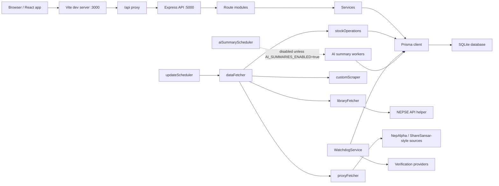

# NEPSE Stock Website Architecture

This document is the current source map for the NEPSE stock platform. It links the runtime entry points, data flow, storage model, frontend screens, and operational scripts so a new agent can land in the codebase without scanning every file first.

## System Summary

| Area | Current shape |
| --- | --- |
| Runtime | Two-process development setup: Express API on port `5000`, Vite React frontend on port `3000` with `/api` proxy |
| Production mode | Express can serve `frontend/dist` and the API from one process |
| Backend | Node.js, Express, Prisma, SQLite, node-schedule |
| Frontend | React 18, Vite, React Router, Axios, custom CSS |
| Data sources | `nepse-api-helper` first, proxy/public sources next, mock data only when configured |
| Storage | SQLite through Prisma; JSON data files are legacy/fallback/runtime artifacts |
| Auth | JWT access tokens, httpOnly refresh cookie, protected user routes |
| Admin protection | `x-admin-key` checked by admin middleware plus stricter rate limiting |
| AI summaries | Optional disabled scaffold under `/api/ai-summaries`; no active AI summary UI |

## Start Here

| Need | Read first |
| --- | --- |
| Backend boot and route mounting | [backend/src/server.js](backend/src/server.js) |
| API route behavior | [docs/API.md](docs/API.md) and [backend/src/routes](backend/src/routes) |
| Database schema | [backend/prisma/schema.prisma](backend/prisma/schema.prisma) |
| Live market sync | [backend/src/services/scheduler/updateScheduler.js](backend/src/services/scheduler/updateScheduler.js) and [backend/src/services/dataFetcher.js](backend/src/services/dataFetcher.js) |
| Scraper source priority | [backend/src/services/scrapers/libraryFetcher.js](backend/src/services/scrapers/libraryFetcher.js), [backend/src/services/scrapers/proxyFetcher.js](backend/src/services/scrapers/proxyFetcher.js), [backend/src/services/scrapers/customScraper.js](backend/src/services/scrapers/customScraper.js) |
| Data integrity watchdog | [docs/WATCHDOG.md](docs/WATCHDOG.md) and [backend/src/services/watchdog/WatchdogService.js](backend/src/services/watchdog/WatchdogService.js) |
| Frontend route tree | [frontend/src/App.jsx](frontend/src/App.jsx) |
| Frontend API client | [frontend/src/services/api.js](frontend/src/services/api.js) |
| Agent retrieval map | [docs/CODEBASE_MAP.md](docs/CODEBASE_MAP.md) |
| Setup and production runbook | [START_GUIDE.md](START_GUIDE.md) |

## Runtime Graph

```mermaid
flowchart LR
    Browser["Browser / React app"] --> Vite["Vite dev server :3000"]
    Vite --> ApiProxy["/api proxy"]
    ApiProxy --> Express["Express API :5000"]

    Express --> Routes["Route modules"]
    Routes --> Services["Services"]
    Services --> Prisma["Prisma client"]
    Prisma --> Sqlite["SQLite database"]

    Scheduler["updateScheduler"] --> DataFetcher["dataFetcher"]
    DataFetcher --> Library["libraryFetcher"]
    DataFetcher --> Proxy["proxyFetcher"]
    DataFetcher --> Custom["customScraper"]
    Library --> Nepse["NEPSE API helper"]
    Proxy --> PublicSources["NepAlpha / ShareSansar-style sources"]
    DataFetcher --> StockOps["stockOperations"]
    StockOps --> Prisma

    Watchdog["WatchdogService"] --> Providers["Verification providers"]
    Watchdog --> Prisma

    AiScheduler["aiSummaryScheduler"]
    AiScheduler -. "disabled unless AI_SUMMARIES_ENABLED=true" .-> AiWorkers["AI summary workers"]
    AiWorkers --> Prisma
```

## Backend Architecture

### Entry Point

[backend/src/server.js](backend/src/server.js) creates the Express app, applies security middleware, mounts routes, connects Prisma, initializes analytics, starts schedulers, and handles graceful shutdown.

Mounted route groups:

| Mount | Route file | Purpose |
| --- | --- | --- |
| `/api/auth` | [backend/src/routes/auth.js](backend/src/routes/auth.js) | Register, login, refresh, logout, current user |
| `/api/watchlists` | [backend/src/routes/watchlists.js](backend/src/routes/watchlists.js) | Authenticated watchlists and public share slugs |
| `/api/portfolios` | [backend/src/routes/portfolios.js](backend/src/routes/portfolios.js) | Authenticated portfolios, trades, P/L summaries |
| `/api/alerts` | [backend/src/routes/alerts.js](backend/src/routes/alerts.js) | Authenticated price alerts |
| `/api/stocks` | [backend/src/routes/stocks.js](backend/src/routes/stocks.js) | Stock list, detail, search, sectors, metrics, history, depth, admin cleanup |
| `/api/ipos` | [backend/src/routes/ipos.js](backend/src/routes/ipos.js) | IPO list, active IPOs, status filters, search |
| `/api` | [backend/src/routes/market.js](backend/src/routes/market.js) | Market summary, history, metrics, health, scheduler status, admin sync |
| `/api/watchdog` | [backend/src/routes/watchdog.js](backend/src/routes/watchdog.js) | Data verification and watchdog reports |
| `/api/stream` | [backend/src/routes/stream.js](backend/src/routes/stream.js) | Streaming/live update channel |
| `/api/ai-summaries` | [backend/src/routes/aiSummaries.js](backend/src/routes/aiSummaries.js) | Disabled-by-default AI summary status, reads, admin run trigger |

### Middleware

| File | Responsibility |
| --- | --- |
| [backend/src/middleware/cors.js](backend/src/middleware/cors.js) | CORS allowlist and frontend/API access control |
| [backend/src/middleware/rateLimiter.js](backend/src/middleware/rateLimiter.js) | Global, admin, search, and login rate limits |
| [backend/src/middleware/auth.js](backend/src/middleware/auth.js) | Admin API key validation via `x-admin-key` |
| [backend/src/middleware/authMiddleware.js](backend/src/middleware/authMiddleware.js) | JWT auth, refresh cookie helpers |
| [backend/src/middleware/errorHandler.js](backend/src/middleware/errorHandler.js) | Async wrapper, validation error handling, 404, global error response |

### Service Boundaries

| Service area | Files | Notes |
| --- | --- | --- |
| Market ingestion | [dataFetcher.js](backend/src/services/dataFetcher.js), [dataEnricher.js](backend/src/services/dataEnricher.js) | Fetches source data, filters non-ordinary securities, enriches symbols, stores current data |
| Scrapers | [backend/src/services/scrapers](backend/src/services/scrapers) | Library, proxy, custom, mock, market summary, missing securities, and transformer modules |
| Scheduler | [updateScheduler.js](backend/src/services/scheduler/updateScheduler.js) | Chooses update cadence from market state and circuit breaker/failure status |
| Database operations | [backend/src/services/database](backend/src/services/database) | Prisma connection plus stock, market, and IPO operations |
| Metrics | [backend/src/services/metrics](backend/src/services/metrics) | Price, moving average, momentum, liquidity, relative, fundamentals, cumulative, and signal metrics |
| Watchdog | [backend/src/services/watchdog](backend/src/services/watchdog) | Compares local data against external providers and writes reports |
| AI summaries | [backend/src/services/ai](backend/src/services/ai), [aiSummaryScheduler.js](backend/src/services/scheduler/aiSummaryScheduler.js) | Optional cost-limited scaffold; disabled unless explicitly enabled |
| User utilities | [portfolioCalculator.js](backend/src/services/portfolioCalculator.js), [alertEngine.js](backend/src/services/alertEngine.js), [streamManager.js](backend/src/services/streamManager.js) | User-facing calculations, alert delivery logic, and streaming |
| Shared utilities | [backend/src/services/utils](backend/src/services/utils) | Logger, retry, time, holidays, validation, normalization, alerts, update locks |

## Database Architecture

The Prisma schema is in [backend/prisma/schema.prisma](backend/prisma/schema.prisma). SQLite is the active datasource.

| Model group | Models | Purpose |
| --- | --- | --- |
| Market data | `Stock`, `MarketHistory`, `MarketSummary`, `SectorIndex`, `StockMetrics` | Current prices, history, market breadth, sector index data, computed metrics |
| IPOs | `Ipo` | IPO listings and status |
| Users/auth | `User`, `RefreshToken` | User accounts and refresh-token rotation |
| Watchlists | `Watchlist`, `WatchlistItem` | User watchlists and public share links |
| Portfolios | `Portfolio`, `Trade` | User portfolio holdings and trade ledger |
| Alerts | `Alert`, `AlertDelivery` | Alert definitions and delivery history |
| AI summaries | `AiRun`, `StockAiSummary`, `MarketAiSummary`, `TradingSession`, `Lock` | Optional disabled scaffold for future scheduled summaries |

Key persistence rules:

1. `Stock.symbol` is the unique application-level stock identifier.
2. `MarketHistory` is unique by `(symbol, date)`.
3. User-owned objects always filter by `req.user.userId` before mutation or read.
4. Admin-only mutations require `x-admin-key`.
5. Runtime database files and generated JSON data are ignored by Git.

## Data Flow

### Live Market Sync

1. [server.js](backend/src/server.js) starts [updateScheduler.js](backend/src/services/scheduler/updateScheduler.js).
2. Scheduler reads market state from [marketTime.js](backend/src/services/utils/marketTime.js).
3. Scheduler calls [dataFetcher.fetchLatestData](backend/src/services/dataFetcher.js).
4. `dataFetcher` tries source modules in priority order: mock in configured development cases, library, proxy, custom.
5. Source payloads are transformed and enriched with stock directory data from [nepseStocks.js](backend/src/data/nepseStocks.js).
6. Non-ordinary securities are filtered before current stock storage.
7. [stockOperations.js](backend/src/services/database/stockOperations.js) and [marketOperations.js](backend/src/services/database/marketOperations.js) persist data through Prisma.
8. Alerts, metrics, streaming, and watchdog checks consume the persisted state.

### API Read Path

1. React calls [frontend/src/services/api.js](frontend/src/services/api.js).
2. Vite proxies `/api` to Express during development.
3. Express route modules validate request params and call service/database layers.
4. Responses follow the common `{ success, data, ... }` shape.
5. Frontend hooks and pages render the returned payloads.

### Authenticated User Path

1. [LoginPage.jsx](frontend/src/pages/LoginPage.jsx) or [RegisterPage.jsx](frontend/src/pages/RegisterPage.jsx) calls `/api/auth`.
2. [auth.js](backend/src/routes/auth.js) hashes passwords with bcrypt and issues an access token.
3. Refresh tokens are stored server-side and sent as an httpOnly cookie.
4. [useAuth.jsx](frontend/src/hooks/useAuth.jsx) holds the access token client-side for protected API calls.
5. [ProtectedRoute.jsx](frontend/src/components/ProtectedRoute.jsx) gates portfolio and alert screens.

### Health and Stability Path

1. [GET /api/health](backend/src/routes/market.js) evaluates scheduler state, fetcher state, market freshness, stock count, and market summary presence.
2. [GET /api/health/ready](backend/src/routes/market.js) returns `503` when required data is not ready.
3. [backend/scripts/ops.js](backend/scripts/ops.js) is the consolidated backend verification entry point.
4. [backend/scripts/stability-check.js](backend/scripts/stability-check.js) exercises broader API/user workflows against a running server.

## Frontend Architecture

### App Shell

[frontend/src/main.jsx](frontend/src/main.jsx) renders React into the page. [frontend/src/App.jsx](frontend/src/App.jsx) wires `AuthProvider`, `ErrorBoundary`, `Header`, and route definitions.

| Route | Page | Main responsibility |
| --- | --- | --- |
| `/` | [HomePage.jsx](frontend/src/pages/HomePage.jsx) | Market summary, metrics, sector chart, stock table |
| `/stock/:symbol` | [StockDetailPage.jsx](frontend/src/pages/StockDetailPage.jsx) | Single-stock detail, history chart, metrics, depth |
| `/ipos` | [IPOPage.jsx](frontend/src/pages/IPOPage.jsx) | IPO list and filters |
| `/top-movers` | [TopMoversPage.jsx](frontend/src/pages/TopMoversPage.jsx) | Gainers, losers, traded, unchanged |
| `/search` | [SearchResultsPage.jsx](frontend/src/pages/SearchResultsPage.jsx) | Search results from global query |
| `/login` | [LoginPage.jsx](frontend/src/pages/LoginPage.jsx) | User login |
| `/register` | [RegisterPage.jsx](frontend/src/pages/RegisterPage.jsx) | User registration |
| `/portfolio` | [PortfolioPage.jsx](frontend/src/pages/PortfolioPage.jsx) | Protected portfolio management |
| `/alerts` | [AlertsPage.jsx](frontend/src/pages/AlertsPage.jsx) | Protected alert management |
| `/w/:slug` | [SharedWatchlistPage.jsx](frontend/src/pages/SharedWatchlistPage.jsx) | Public watchlist viewer |

### Frontend Layers

| Layer | Files | Responsibility |
| --- | --- | --- |
| API client | [frontend/src/services/api.js](frontend/src/services/api.js) | Axios instance, response unwrap helpers, endpoint functions |
| Auth state | [frontend/src/hooks/useAuth.jsx](frontend/src/hooks/useAuth.jsx) | Login/register/refresh/logout and current user state |
| Data hooks | [frontend/src/hooks](frontend/src/hooks) | Live polling, stock data, IPO data, filters, sorting, local storage |
| UI primitives | [frontend/src/components/ui](frontend/src/components/ui) | Button, badge, select, skeleton |
| Domain components | [frontend/src/components](frontend/src/components) | Stock table, charts, cards, market breadth, metrics, search, portfolio summaries |
| Styling | [frontend/src/App.css](frontend/src/App.css), component CSS files | Design tokens and component-specific styles |

## Operational Scripts

| Command | Scope |
| --- | --- |
| `npm run verify` | Backend consolidated verify, frontend tests, frontend build |
| `npm run verify:stable` | Full verify plus backend stability script |
| `cd backend && npm run verify` | Backend syntax/config/API-oriented checks through [ops.js](backend/scripts/ops.js) |
| `cd backend && npm test` | Backend Jest test suite |
| `cd frontend && npm test -- --run` | Frontend Vitest suite |
| `cd frontend && npm run build` | Production frontend build |

## Cleanup Notes

Removed/stale items should not be reintroduced without a feature owner:

1. The old stock-pick scorer endpoint and UI are not present. Unused scorer helper files and the stale `docs/AI_STOCK_PICKS.md` document were removed.
2. AI-generated summaries are represented only by the disabled scaffold. Enable it with environment variables only after reviewing cost, provider, compliance, and UI requirements.
3. Cloudflare tunnel tokens must never be committed. Use environment variables or local ignored config files only.
4. `.github/copilot-instructions.md` should point to this project map, not to unrelated app testing protocols.

## Related Documentation

| Document | Purpose |
| --- | --- |
| [docs/CODEBASE_MAP.md](docs/CODEBASE_MAP.md) | Agent-oriented retrieval map with linked nodes and change entry points |
| [docs/API.md](docs/API.md) | REST endpoint reference |
| [docs/SECURITY.md](docs/SECURITY.md) | Security posture and hardening notes |
| [docs/WATCHDOG.md](docs/WATCHDOG.md) | Data integrity service details |
| [docs/SETUP.md](docs/SETUP.md) | Setup guide |
| [START_GUIDE.md](START_GUIDE.md) | Local and production runbook |
