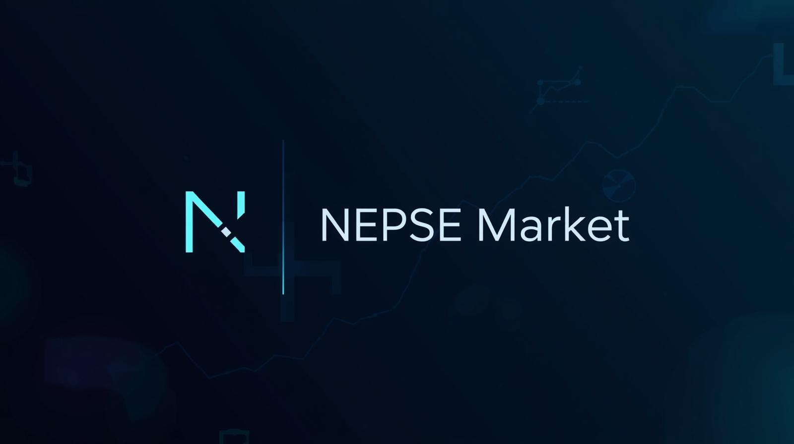

<div align="center">



# NEPSE Stock Platform

**A real-time dashboard for the Nepal Stock Exchange — live prices, technical metrics, portfolios, watchlists, and price alerts in one place.**

[](https://github.com/Rojan248/nepse-stock-website/actions/workflows/ci.yml)
[](LICENSE)

</div>

---

I built this because NEPSE data is scattered across slow, ad-heavy websites that are painful to use on a phone. This project pulls market data straight from NEPSE's own JSON endpoints, verifies it against secondary sources before trusting it, and serves it through a fast, clean interface.

## What it does

- **Live market data** — prices refresh automatically while the market is open, and back off politely when it's closed
- **Stock pages with depth** — OHLC history, moving averages, momentum/liquidity metrics, and Level 2 market depth per symbol
- **Portfolios & alerts** — track your holdings with P/L summaries and get notified when price conditions hit
- **Watchlists you can share** — public share links for any list (`/w/:slug`)
- **Data integrity watchdog** — every sync is cross-checked against independent sources; anomalies like sudden ±15% price jumps get rejected before they touch the database
- **IPO tracking** — active and upcoming IPOs with status filters

## Stack

| Layer | Tools |
|---|---|
| Frontend | React 18, Vite, React Router, Lightweight Charts |
| Backend | Node.js, Express |
| Database | SQLite via Prisma |
| Scheduling | node-schedule (market-aware update cadence) |
| Data source | `nepse-api-helper` (official NEPSE API), proxy/scrape fallbacks |

## Quick start

```bash
git clone https://github.com/Rojan248/nepse-stock-website.git
cd nepse-stock-website

npm run setup        # installs backend + frontend deps, builds frontend

cd backend
cp .env.example .env # then set ADMIN_API_KEY / JWT_SECRET / DATABASE_URL
npx prisma generate && npx prisma migrate dev --name init
npm run dev          # Express on :5000
```

```bash
cd frontend
npm run dev          # Vite on :3000, proxies /api → :5000
```

Open **http://localhost:3000** and you're running.

## Production

The backend can serve both the built frontend and the API from one process:

```bash
npm run build:frontend
cd backend && npm run pm2:start
```

Or use Docker:

```bash
docker compose up -d
```

## Verifying things work

```bash
npm run verify         # backend checks + full test suites + frontend build
npm run verify:stable  # adds broader stability checks against a running server
```

Backend has 373 Jest tests covering auth, rate limiting, security headers, CORS, and data operations. Frontend runs Vitest. CI ([ci.yml](.github/workflows/ci.yml)) runs all of it on every PR.

## How the pipeline works

```
updateScheduler ──▶ dataFetcher ──▶ libraryFetcher (official NEPSE API)
                        │               ├──▶ proxyFetcher (fallback)
                        │               └──▶ customScraper (fallback)
                        ▼
              anomaly check (±15% circuit breaker)
                        ▼
                Prisma ▶ SQLite ──▶ REST API ◀── React app
```

Sources are tried in priority order, normalized into a common shape, enriched with company metadata, filtered for non-equity securities, and only then persisted.

## Documentation

| Doc | What's in it |
|---|---|
| [ARCHITECTURE.md](ARCHITECTURE.md) | Full system map — routes, services, data flow diagrams |
| [docs/API.md](docs/API.md) | Every REST endpoint |
| [START_GUIDE.md](START_GUIDE.md) | Local + production runbook, Cloudflare tunnel setup |
| [docs/SECURITY.md](docs/SECURITY.md) | Security posture and hardening notes |
| [docs/WATCHDOG.md](docs/WATCHDOG.md) | How the data integrity service works |
| [spec.md](spec.md) | Original MVP specification |

## License

[MIT](LICENSE)
