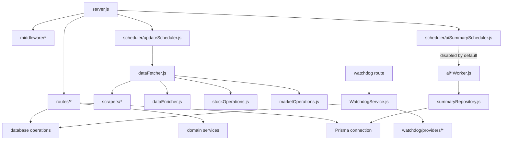
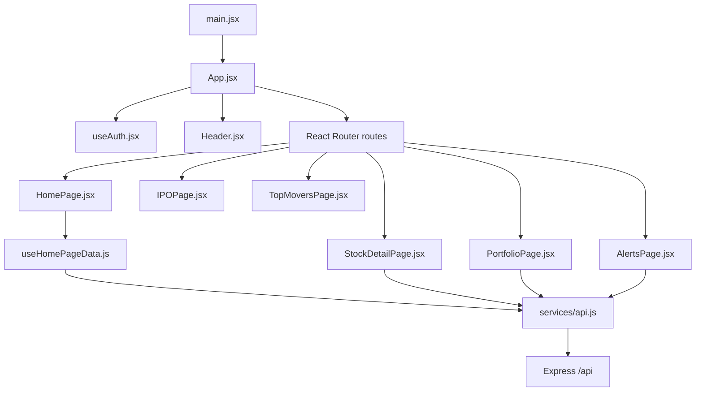

# Codebase Map

This file is a retrieval map for future agents and maintainers. Use it with [../ARCHITECTURE.md](../ARCHITECTURE.md) when you need precise entry points without spending tokens on a full-codebase scan.

## First Five Files

Read these in order for most tasks:

1. [../AGENTS.md](../AGENTS.md) - local agent rules and required skills.
2. [../ARCHITECTURE.md](../ARCHITECTURE.md) - system-level architecture and data flow.
3. [../backend/src/server.js](../backend/src/server.js) - backend boot, middleware, route mounting, schedulers.
4. [../backend/prisma/schema.prisma](../backend/prisma/schema.prisma) - database model boundaries.
5. [../frontend/src/App.jsx](../frontend/src/App.jsx) - frontend routes and protected page layout.

## Change Entry Points

| Task | Start here | Then check |
| --- | --- | --- |
| Add or change a stock API | [../backend/src/routes/stocks.js](../backend/src/routes/stocks.js) | [../backend/src/services/database/stockOperations.js](../backend/src/services/database/stockOperations.js), [../frontend/src/services/api.js](../frontend/src/services/api.js) |
| Fix NEPSE index or market breadth | [../backend/src/routes/market.js](../backend/src/routes/market.js) | [../backend/src/services/database/marketOperations.js](../backend/src/services/database/marketOperations.js), [../backend/src/services/scrapers/marketSummaryFetcher.js](../backend/src/services/scrapers/marketSummaryFetcher.js) |
| Change live scraping speed/limits | [../backend/src/services/scheduler/updateScheduler.js](../backend/src/services/scheduler/updateScheduler.js) | [../backend/src/services/dataFetcher.js](../backend/src/services/dataFetcher.js), [../backend/src/services/utils/asyncRetry.js](../backend/src/services/utils/asyncRetry.js) |
| Change source priority | [../backend/src/services/dataFetcher.js](../backend/src/services/dataFetcher.js) | [../backend/src/services/scrapers/libraryFetcher.js](../backend/src/services/scrapers/libraryFetcher.js), [../backend/src/services/scrapers/proxyFetcher.js](../backend/src/services/scrapers/proxyFetcher.js) |
| Fix auth/session behavior | [../backend/src/routes/auth.js](../backend/src/routes/auth.js) | [../backend/src/middleware/authMiddleware.js](../backend/src/middleware/authMiddleware.js), [../frontend/src/hooks/useAuth.jsx](../frontend/src/hooks/useAuth.jsx) |
| Fix admin endpoint access | [../backend/src/middleware/auth.js](../backend/src/middleware/auth.js) | [../backend/src/middleware/rateLimiter.js](../backend/src/middleware/rateLimiter.js), route-specific `adminLimiter` usage |
| Change watchlists | [../backend/src/routes/watchlists.js](../backend/src/routes/watchlists.js) | [../frontend/src/components/SharedWatchlistView.jsx](../frontend/src/components/SharedWatchlistView.jsx), [../frontend/src/pages/SharedWatchlistPage.jsx](../frontend/src/pages/SharedWatchlistPage.jsx) |
| Change portfolios | [../backend/src/routes/portfolios.js](../backend/src/routes/portfolios.js) | [../backend/src/services/portfolioCalculator.js](../backend/src/services/portfolioCalculator.js), [../frontend/src/pages/PortfolioPage.jsx](../frontend/src/pages/PortfolioPage.jsx) |
| Change alerts | [../backend/src/routes/alerts.js](../backend/src/routes/alerts.js) | [../backend/src/services/alertEngine.js](../backend/src/services/alertEngine.js), [../frontend/src/pages/AlertsPage.jsx](../frontend/src/pages/AlertsPage.jsx) |
| Change stock detail page | [../frontend/src/pages/StockDetailPage.jsx](../frontend/src/pages/StockDetailPage.jsx) | [../frontend/src/components/StockChart.jsx](../frontend/src/components/StockChart.jsx), [../frontend/src/components/depth](../frontend/src/components/depth) |
| Change home dashboard | [../frontend/src/pages/HomePage.jsx](../frontend/src/pages/HomePage.jsx) | [../frontend/src/hooks/useHomePageData.js](../frontend/src/hooks/useHomePageData.js), [../frontend/src/components/StockTable.jsx](../frontend/src/components/StockTable.jsx) |
| Change frontend API call shape | [../frontend/src/services/api.js](../frontend/src/services/api.js) | Matching backend route and tests |
| Change data model | [../backend/prisma/schema.prisma](../backend/prisma/schema.prisma) | Existing migrations, route/service reads, tests |
| Change optional AI summary scaffold | [../backend/src/routes/aiSummaries.js](../backend/src/routes/aiSummaries.js) | [../backend/src/services/ai](../backend/src/services/ai), [../backend/src/services/scheduler/aiSummaryScheduler.js](../backend/src/services/scheduler/aiSummaryScheduler.js) |

## Backend Node Graph

## Frontend Node Graph

## Data Ownership Rules

| Data | Owner | Notes |
| --- | --- | --- |
| Current stock rows | [stockOperations.js](../backend/src/services/database/stockOperations.js) | Preserve existing LTP when incoming source data is unusable; keep non-ordinary securities filtered out |
| Market summary rows | [marketOperations.js](../backend/src/services/database/marketOperations.js) | Used by health, dashboard summary, market history |
| Historical prices | [historicalDataFetcher.js](../backend/src/services/historicalDataFetcher.js), [MarketHistory](../backend/prisma/schema.prisma) | Unique by symbol/date |
| Computed metrics | [metricsOrchestrator.js](../backend/src/services/metrics/metricsOrchestrator.js) | Feeds stock detail metrics and market metrics |
| Users and sessions | [auth.js](../backend/src/routes/auth.js) | Passwords are bcrypt hashes; refresh tokens are server-side records plus httpOnly cookie |
| Watchlists | [watchlists.js](../backend/src/routes/watchlists.js) | Public share access exposes only list metadata and symbols |
| Portfolios | [portfolios.js](../backend/src/routes/portfolios.js) | Always scoped by authenticated user |
| Alerts | [alerts.js](../backend/src/routes/alerts.js) | Always scoped by authenticated user |
| AI summaries | [summaryRepository.js](../backend/src/services/ai/summaryRepository.js) | Optional, disabled by default |

## Verification Map

Use the smallest verification that covers the change:

| Change type | Command |
| --- | --- |
| Backend route/service only | `cd backend && npm test` |
| Backend syntax/config/data stability | `cd backend && npm run verify` |
| Full backend + frontend confidence | `npm run verify` |
| Full local stability after server is running | `cd backend && npm run stable` |
| Frontend component/hook only | `cd frontend && npm test -- --run` |
| Frontend build or route import changes | `cd frontend && npm run build` |

## Stability Boundaries

1. Do not commit `.env`, SQLite database files, logs, Cloudflare credentials, or generated JSON data.
2. Do not add public AI-generated investment advice without compliance review and feature flags.
3. Keep admin mutations behind `adminLimiter` and `requireAdminKey`.
4. Keep user-owned data filtered by `req.user.userId` before reads and writes.
5. Keep scraper changes small and verify with health/status endpoints because source HTML/API behavior can change.
6. Prefer updating [../docs/API.md](API.md) and [../ARCHITECTURE.md](../ARCHITECTURE.md) when changing route shape or module ownership.

## Recently Cleaned Nodes

The old stock-pick scorer files and stale `docs/AI_STOCK_PICKS.md` were removed because no route, frontend component, test, or worker imported them. The current optional AI functionality is the disabled summary scaffold documented in [../ARCHITECTURE.md](../ARCHITECTURE.md).
