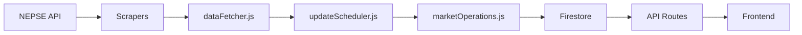

# Real-Time Market State Implementation Plan

This document outlines the analysis findings, implementation plan, and verification strategy for adding real-time market state tracking to the NEPSE Stock Website.

---

## Phase 1: Analysis Findings

### 1.1 Current Data Flow



**Data Flow Details:**
1. **Scrapers** (`libraryFetcher.js`, `proxyFetcher.js`, `customScraper.js`) fetch raw NEPSE data
2. **dataFetcher.js** orchestrates fetching with fallback strategy and enriches data
3. **updateScheduler.js** triggers fetches at 8s intervals during market hours, 1hr when closed
4. **marketOperations.js** persists market summary to Firestore (`marketSummary/current`)
5. **API Routes** (`routes/market.js`) serve data via REST endpoints
6. **Frontend** (`HomePage.jsx`, `Header.jsx`) poll API endpoints for display

### 1.2 Current Scheduler Configuration

| Setting | Value | Location |
|---------|-------|----------|
| Market Open Interval | 8 seconds | `updateScheduler.js` line 31 |
| Market Closed Interval | 1 hour | `updateScheduler.js` line 32 |
| Frontend Polling (HomePage) | 15 seconds | `HomePage.jsx` line 12 |
| Frontend Polling (Header) | 30 seconds | `Header.jsx` line 16 |
| Constants REFRESH_INTERVAL | 10 seconds | `constants.js` line 98 |
| Market Hours | 10:00-15:00 NST | `updateScheduler.js` lines 25-28 |
| Market Days | Sun-Thu (0-4) | `updateScheduler.js` lines 56-60 |

### 1.3 Files Reading/Writing to Market Collections

**Backend (Write):**
- [marketOperations.js](file:///c:/Users/Administrator/Documents/STOCK/nepse-stock-website/backend/src/services/database/marketOperations.js) - Writes to `marketSummary` and `marketHistory` collections

**Backend (Read):**
- [market.js](file:///c:/Users/Administrator/Documents/STOCK/nepse-stock-website/backend/src/routes/market.js) - Reads via marketOperations for API responses
- [updateScheduler.js](file:///c:/Users/Administrator/Documents/STOCK/nepse-stock-website/backend/src/services/scheduler/updateScheduler.js) - Orchestrates updates

**Frontend (Read via API):**
- [api.js](file:///c:/Users/Administrator/Documents/STOCK/nepse-stock-website/frontend/src/services/api.js) - `getMarketSummary()`, `getServerHealth()`
- [HomePage.jsx](file:///c:/Users/Administrator/Documents/STOCK/nepse-stock-website/frontend/src/pages/HomePage.jsx) - Displays market summary cards
- [Header.jsx](file:///c:/Users/Administrator/Documents/STOCK/nepse-stock-website/frontend/src/components/Header.jsx) - Displays market status badge

### 1.4 Conflict Analysis

#### 1.4.1 Scheduler Interval Change (8s → 10s)

| Aspect | Finding | Risk |
|--------|---------|------|
| Backend logic | No hardcoded assumptions about 8s | ✅ Low |
| Frontend polling | Uses independent intervals (15s, 30s) | ✅ Low |
| Tests | `scheduler.test.js` tests status, not intervals | ✅ Low |
| Environment config | Interval is configurable via `NEPSE_UPDATE_INTERVAL` | ✅ Low |

**Conclusion:** Safe to change. No breaking logic detected.

#### 1.4.2 Frontend Polling Conflicts

| Component | Current Interval | Conflict? |
|-----------|------------------|-----------|
| HomePage.jsx | 15s (hardcoded) | ⚠️ Should use constants |
| Header.jsx | 30s (hardcoded) | ⚠️ Should use constants |
| constants.js | 10s (REFRESH_INTERVAL) | ✅ Already defined |

**Recommendation:** Align all polling to use `REFRESH_INTERVAL` constant (10s).

#### 1.4.3 Firestore Schema Compatibility

Current `marketSummary/current` document structure:
```javascript
{
  indexValue: Number,
  indexChange: Number,
  indexChangePercent: Number,
  totalTransactions: Number,
  totalTurnover: Number,
  totalVolume: Number,
  timestamp: String (ISO),
  updatedAt: String (ISO)
}
```

**New fields required:**
- `state`: String (`OPEN`, `CLOSED_TODAY`, `WEEKEND`, `PRE_OPEN`)
- `isPreviousClose`: Boolean
- `asOf`: String (ISO timestamp of the data, not when it was stored)

**Compatibility:** ✅ Firestore is schemaless - new fields can be added without migration. Existing queries won't break.

#### 1.4.4 API Route Caching

- **Finding:** No response caching detected in `routes/market.js`
- **Risk:** ✅ None - real-time updates will work immediately

### 1.5 Dependency Check

| Dependency | Installed? | Notes |
|------------|------------|-------|
| luxon | ❌ No | Not required - existing `getNSTTime()` uses manual UTC+5:45 offset |
| node-schedule | ✅ Yes | Used for daily cleanup job |
| firebase-admin | ✅ Yes | Firestore operations |

**Decision:** No new dependencies needed. Extend existing `getNSTTime()` utility.

### 1.6 Existing Utilities to Extend

**Backend:**
- `getNSTTime()` in [updateScheduler.js](file:///c:/Users/Administrator/Documents/STOCK/nepse-stock-website/backend/src/services/scheduler/updateScheduler.js#L38-43) - Calculates Nepal Standard Time
- `isMarketOpen()` in [updateScheduler.js](file:///c:/Users/Administrator/Documents/STOCK/nepse-stock-website/backend/src/services/scheduler/updateScheduler.js#L50-68) - Checks if market is open

**Frontend:**
- `useLiveData()` hook in [useLiveData.js](file:///c:/Users/Administrator/Documents/STOCK/nepse-stock-website/frontend/src/hooks/useLiveData.js) - Polling with change detection
- `REFRESH_INTERVAL` in [constants.js](file:///c:/Users/Administrator/Documents/STOCK/nepse-stock-website/frontend/src/utils/constants.js#L98) - Already set to 10s

### 1.7 Edge Cases

| Scenario | Current Behavior | Required Behavior |
|----------|------------------|-------------------|
| Scheduler starts on weekend | Fetches immediately, then 1hr interval | Show last Friday's data with `isPreviousClose: true` |
| NEPSE API down during market hours | Stops updating, logs errors | Keep last known good data, set `isStale: true` |
| User opens at 14:59 (1 min before close) | Shows "Open" status | Transition to "Closed" at 15:00 |
| Server restart during market hours | Fetches fresh data immediately | ✅ Already works - initial fetch on startup |
| Public holidays (not Fri/Sat) | Treated as market day | Manual handling initially (future: holiday API) |

---

## User Review Required

> [!IMPORTANT]
> **Holiday Handling:** This implementation will NOT automatically detect public holidays beyond Friday/Saturday. Holidays will need to be manually configured or fetched from an external API in a future update. Is this acceptable for the initial release?

> [!WARNING]
> **Breaking Change:** The `/api/market-summary` response will include new fields (`state`, `isPreviousClose`, `asOf`). Existing API consumers will receive these additional fields. The existing fields remain unchanged, so this is backwards-compatible.

---

## Phase 2: Proposed Changes

### Backend Changes

---

#### [NEW] [marketTime.js](file:///c:/Users/Administrator/Documents/STOCK/nepse-stock-website/backend/src/services/utils/marketTime.js)

New utility module for market time and state calculations:
- `getNepseNow()` - Get current Nepal Standard Time
- `getMarketState()` - Return market state enum (`OPEN`, `CLOSED_TODAY`, `WEEKEND`, `PRE_OPEN`)
- `isMarketActive()` - Boolean check for active trading hours
- `getNextMarketOpen()` - Calculate next market open time

---

#### [MODIFY] [updateScheduler.js](file:///c:/Users/Administrator/Documents/STOCK/nepse-stock-website/backend/src/services/scheduler/updateScheduler.js)

Changes:
1. Change `MARKET_OPEN_INTERVAL` from 8000ms to 10000ms
2. Import and use new `marketTime.js` utilities
3. Add market state to fetch cycle logging
4. Export market state for API consumption

---

#### [MODIFY] [marketOperations.js](file:///c:/Users/Administrator/Documents/STOCK/nepse-stock-website/backend/src/services/database/marketOperations.js)

Changes:
1. Add `state`, `isPreviousClose`, `asOf` fields to saved documents
2. Update `getLatestMarketSummary()` to include these fields in response
3. Add logic to detect if data is from previous close

---

#### [MODIFY] [market.js](file:///c:/Users/Administrator/Documents/STOCK/nepse-stock-website/backend/src/routes/market.js)

Changes:
1. Include new market state fields in `/api/market-summary` response
2. Add optional `state` to `/api/health` response

---

### Frontend Changes

---

#### [NEW] [useMarketSummary.js](file:///c:/Users/Administrator/Documents/STOCK/nepse-stock-website/frontend/src/hooks/useMarketSummary.js)

New hook for market summary with intelligent polling:
- Polls at 10s during active market hours
- Reduces polling during closed hours
- Exposes `marketState`, `isPreviousClose`, `asOf` fields
- Handles loading, error, and stale data states

---

#### [MODIFY] [api.js](file:///c:/Users/Administrator/Documents/STOCK/nepse-stock-website/frontend/src/services/api.js)

Changes:
1. Update `getMarketSummary()` to return new fields
2. Add type hints in JSDoc for new response shape

---

#### [MODIFY] [HomePage.jsx](file:///c:/Users/Administrator/Documents/STOCK/nepse-stock-website/frontend/src/pages/HomePage.jsx)

Changes:
1. Use new `useMarketSummary` hook instead of inline polling
2. Display market state indicator
3. Show "Previous Close" badge when `isPreviousClose` is true
4. Update interval to use `REFRESH_INTERVAL` constant

---

#### [MODIFY] [Header.jsx](file:///c:/Users/Administrator/Documents/STOCK/nepse-stock-website/frontend/src/components/Header.jsx)

Changes:
1. Update market status display to show granular states (not just Open/Closed)
2. Align polling interval with `REFRESH_INTERVAL`

---

#### [MODIFY] [constants.js](file:///c:/Users/Administrator/Documents/STOCK/nepse-stock-website/frontend/src/utils/constants.js)

Changes:
1. Add `MARKET_STATES` enum for frontend usage
2. Add `POLL_INTERVAL_CLOSED` for reduced polling when market is closed

---

### Documentation Updates

---

#### [MODIFY] [ARCHITECTURE.md](file:///c:/Users/Administrator/Documents/STOCK/nepse-stock-website/docs/ARCHITECTURE.md)

- Update scheduler interval from 8s to 10s
- Document new `state`, `isPreviousClose`, `asOf` fields
- Add section on market state handling

---

#### [MODIFY] [API_DOCUMENTATION.md](file:///c:/Users/Administrator/Documents/STOCK/nepse-stock-website/docs/API_DOCUMENTATION.md)

- Update `/api/market-summary` response schema
- Document new fields with examples

---

## Verification Plan

### Automated Tests

#### Backend Unit Tests

**File:** [scheduler.test.js](file:///c:/Users/Administrator/Documents/STOCK/nepse-stock-website/backend/tests/unit/scheduler.test.js)

**Command to run:**
```bash
cd backend && npm test -- tests/unit/scheduler.test.js
```

**New tests to add:**
1. `getMarketState()` returns correct state for each day/time combination
2. `isMarketActive()` returns boolean correctly

#### Backend Integration Tests

**File:** [market.test.js](file:///c:/Users/Administrator/Documents/STOCK/nepse-stock-website/backend/tests/integration/market.test.js)

**Command to run:**
```bash
cd backend && npm test -- tests/integration/market.test.js
```

**New tests to add:**
1. `/api/market-summary` includes `state`, `isPreviousClose`, `asOf` fields
2. Response maintains backwards compatibility with existing fields

### Manual Verification

#### Step 1: Backend Isolation Test

1. Start the backend server:
   ```bash
   cd backend && npm run dev
   ```

2. Check `/api/health` endpoint in browser or curl:
   ```bash
   curl http://localhost:5000/api/health
   ```
   
3. **Expected:** Response includes `market.state` field with value like `WEEKEND`, `CLOSED_TODAY`, or `OPEN`

#### Step 2: Market State Transitions

1. Temporarily modify `marketTime.js` to return different states
2. Verify each state produces correct behavior:
   - `OPEN`: Scheduler fetches every 10s
   - `CLOSED_TODAY`: Scheduler waits until next day
   - `WEEKEND`: Shows previous close data

#### Step 3: Frontend Integration

1. Start frontend dev server:
   ```bash
   cd frontend && npm run dev
   ```

2. Open browser to `http://localhost:5173`
3. **Expected:** 
   - Market status badge shows current state
   - "Previous Close" indicator appears when viewing old data
   - Data updates every 10s when market is open

#### Step 4: Production Build Test

```bash
cd frontend && npm run build
```

**Expected:** Build completes without errors

---

## Conflict Resolution Strategies

| Conflict | Resolution |
|----------|------------|
| Test assertions on scheduler status shape | Update mock in `market.test.js` to include new fields |
| Frontend expects old response shape | New fields are additive; no breaking changes |
| Hardcoded polling intervals in components | Refactor to use `REFRESH_INTERVAL` constant |
| Timezone edge cases | Stick with manual UTC+5:45 offset, tested for DST (Nepal doesn't observe DST) |

---

## Assumptions & Decisions

1. **No luxon dependency:** Continue using manual UTC+5:45 calculation. Nepal does not observe DST, so this is reliable.

2. **Holiday handling deferred:** Public holidays beyond Fri/Sat will be handled in a future update. For now, holidays will show as regular market days with data from last trading day.

3. **Backwards compatible API:** New fields are additive only. No existing fields are removed or renamed.

4. **Polling strategy:** Use 10s during market hours, 60s when market is closed to reduce unnecessary requests.

5. **State transitions:** Frontend will react to state changes from API rather than calculating state locally, ensuring single source of truth.

---

## Implementation Order Summary

### Backend (Estimated: 5 steps)

1. Create `marketTime.js` utility
2. Update `updateScheduler.js` interval and state logic
3. Modify `marketOperations.js` to include new fields
4. Update `routes/market.js` API responses
5. Add/update backend tests

### Frontend (Estimated: 5 steps)

1. Create `useMarketSummary.js` hook
2. Update `api.js` response handling
3. Modify `HomePage.jsx` to use new hook
4. Update `Header.jsx` status display
5. Add market state constants

### Integration (Estimated: 3 steps)

1. Run full stack integration test
2. Verify all market states display correctly
3. Update documentation files
